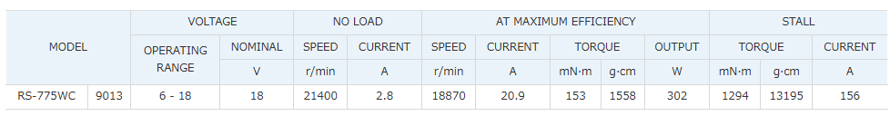

# 構想 
## 作る意味
長期インターン前のリハビリ 
なぜMDか→2週間で完成する必要があり，作り慣れている，新規に学習するコストが掛からないMDが妥当

## 概念
できるだけ小型化し，安価で実装できるように 
リハビリなのでとりあえずは実用性を求めない 
完成よりも技術力を取り戻すことを重視 
kicadのspice機能を極力使用する 
RS-775を回す想定のモータードライバ(20A級)

## 部品
ゲートドライバ：[MCP14700T-E/SN](https://akizukidenshi.com/catalog/g/g108333/) 
